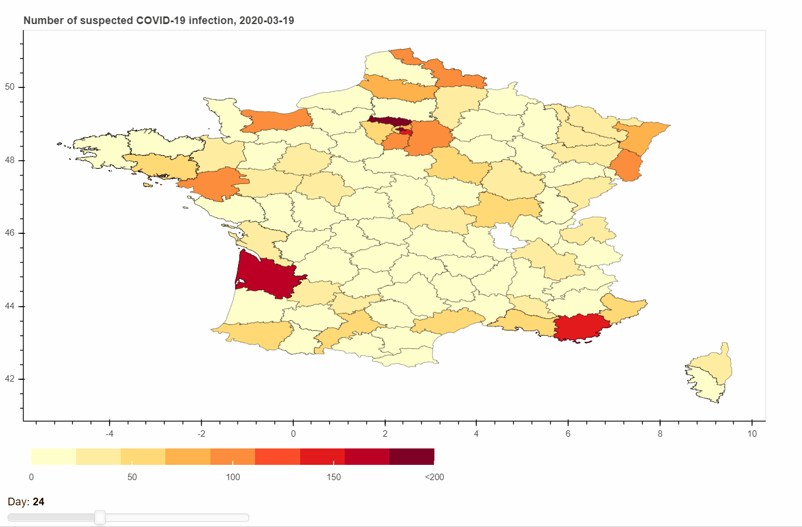

# Covid_19_interactive_map_france
Interactive map of france showing : The number of emergency visits for suspected COVID-19 and number of medical procedures from SOS Doctors for suspected COVID-19 day by day and by department.

# To run the map by yourself:
Create a account on https://www.data.gouv.fr/fr/login?next=https%3A%2F%2Fwww.data.gouv.fr%2Ffr%2F
Generate your api key
create a config.py file in the Covid_19_interactive_map_france folder
copy and paste your api key in the congig file this way:
key = COPY_YOUR_API_KEY_HERE

Use your python console and go to the project directory
then use:
bokeh serve --show Covid_19_interactive_map_france.ipynb in your console

#:
go to https://www.data.gouv.fr/fr/datasets/donnees-des-urgences-hospitalieres-et-de-sos-medecins-relatives-a-lepidemie-de-covid-19/
dowload the latest file by department.
Copy it in the data directory. 
In the notebook change the name of the variable "data_covid" with the new file name

# Sources:
Covid19 french data: https://www.data.gouv.fr/fr/datasets/donnees-des-urgences-hospitalieres-et-de-sos-medecins-relatives-a-lepidemie-de-covid-19/
France department shape files: https://www.data.gouv.fr/fr/datasets/contours-des-departements-francais-issus-d-openstreetmap/#_
(used simplify data "Export 2017 simplifié")

Other sources:
https://towardsdatascience.com/walkthrough-mapping-basics-with-bokeh-and-geopandas-in-python-43f40aa5b7e9
https://towardsdatascience.com/a-complete-guide-to-an-interactive-geographical-map-using-python-f4c5197e23e0

https://doc.data.gouv.fr/api/intro/
